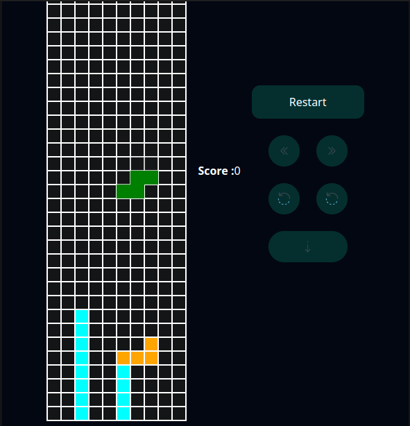

# Tetris-Game

## Demo Video

## Features

- Rotation with Wall Kick.
- Score keeping system.
- Mobile Buttons to play on devices with no keyboard.
- Fast paced with configurable FPS.

## Guide

Up Arrow → Anti-clockwise rotation

Down Arrow → Clockwise rotation

Left, Right Arrows → for left and right movement

Space → Fast Drop

## References

[https://tetris.wiki/Tetris_Guideline](https://tetris.wiki/Tetris_Guideline)

[https://tetris.fandom.com/wiki/Tetris_Guideline](https://tetris.fandom.com/wiki/Tetris_Guideline)

[https://www.codewithfaraz.com/content/141/creating-a-tetris-game-with-javascript#javascript-code](https://www.codewithfaraz.com/content/141/creating-a-tetris-game-with-javascript#javascript-code)
